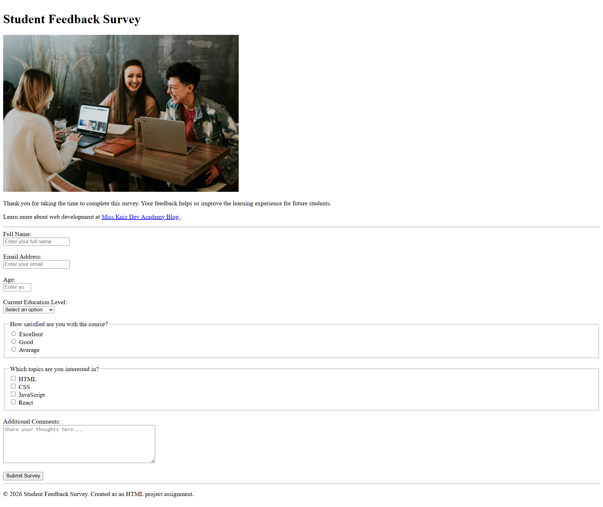

# Assignment: Student Feedback Survey Form

## Objective

Create a complete **Student Feedback Survey** using only HTML. The goal of this assignment is to practice building structured web pages and collecting user input through forms.

---

## Requirements

Build a survey form that includes the following:

### Page Structure

- A main heading for the survey
- A short description explaining the purpose of the survey
- A relevant image
- An external link that opens in a new tab
- Horizontal lines to separate sections
- A footer section

### Form Elements

Include the following form controls:

1. **Full Name**
   - Text input
   - Required field

2. **Email Address**
   - Email input
   - Required field

3. **Age**
   - Number input
   - Minimum and maximum values

4. **Current Education Level**
   - Dropdown menu with multiple options

5. **Course Satisfaction**
   - Radio buttons

6. **Interested Topics**
   - Checkboxes

7. **Additional Comments**
   - Textarea

8. **Submit Button**
   - Form submission button

---

## Topics Covered

This assignment covers the following HTML concepts:

### HTML Fundamentals

- HTML document structure
- Head, body, and title elements

### Semantic HTML

- `form`
- `fieldset`
- `legend`

### Content Elements

- Headings (`h1`)
- Paragraphs (`p`)
- Images (`img`)
- Hyperlinks (`a`)
- Horizontal rules (`hr`)
- Line breaks (`br`)

### Form Elements

- `label`
- `input`
  - text
  - email
  - number
  - radio
  - checkbox

- `select`
- `option`
- `textarea`
- `button`

### Attributes

- `id`
- `name`
- `for`
- `src`
- `alt`
- `placeholder`
- `required`
- `min`
- `max`
- `value`
- `target`

---

## Learning Outcomes

After completing this assignment, students should be able to:

- Create a well-structured HTML page
- Use semantic HTML elements effectively
- Add images and hyperlinks to a webpage
- Build forms with various input types
- Connect labels with form controls
- Use dropdowns, radio buttons, and checkboxes
- Apply basic form validation
- Organize content using fieldsets and legends

---

## Submission Guidelines

- Submit a single HTML file.
- Ensure all form elements work correctly.
- Use proper indentation and formatting.
- Test the webpage in a browser before submission.
- Follow clean and readable coding practices.
